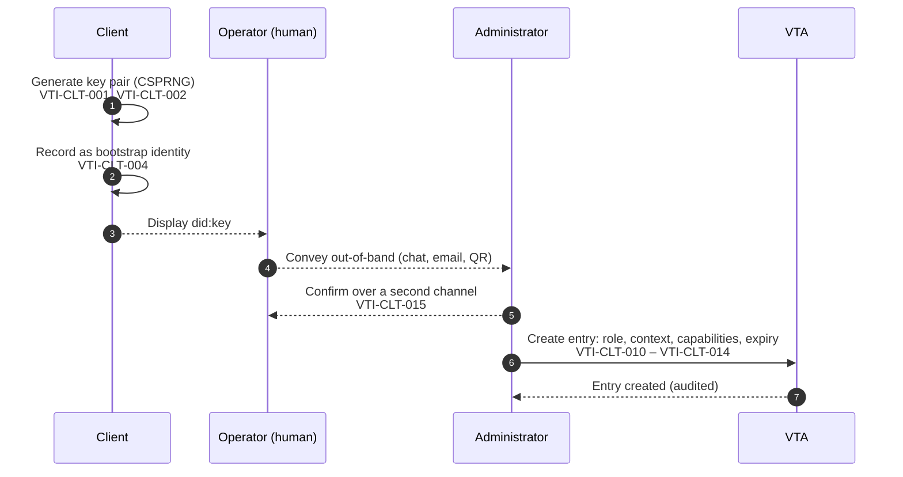

## Appendices

### Appendix A: Client onboarding

This appendix is informative. It illustrates the sequence specified in the
Client Onboarding and Lifecycle chapter, and supplies test vectors for the
parts of it that are decidable without a running node.

#### A.1 Enrolment



The out-of-band hop is the exposed step, and the threat there is substitution
rather than disclosure — which is why step 5 exists, and why a client that
authenticates and finds no entry has to say so distinguishably (VTI-CLT-016)
rather than reporting an ordinary failure to connect.

#### A.2 First connection and the key roll

```mermaid
sequenceDiagram
    autonumber
    participant C as Client
    participant M as Mediator
    participant V as VTA

    C->>V: Authenticate as bootstrap identity
    V-->>C: Session established
    C->>C: Mint replacement key pair<br/>VTI-CLT-022
    C->>M: Prove replacement is reachable (bounded)<br/>VTI-CLT-023
    M-->>C: Reachable
    Note over C,V: Everything above this line is free to fail.<br/>The bootstrap entry is still authoritative.
    C->>V: Swap: current subject + proof of control of new subject<br/>VTI-CLT-025 – VTI-CLT-028
    V->>V: Verify caller = current subject;<br/>new subject = proven holder;<br/>authority preserved exactly
    V-->>C: Entry moved (audited, previous subject recorded)
    Note over C,V: COMMIT POINT. The bootstrap identity now has no standing<br/>and the replacement key exists only in memory.
    C->>C: Persist replacement key material<br/>VTI-CLT-033
    C->>C: Destroy bootstrap private key<br/>VTI-CLT-034
```

Nothing optional may be placed between the commit point and the persist. The
window cannot be removed, so the requirement is that nothing is put inside it.

#### A.3 Worked example

An AI-agent runtime is to summarise documents in one team's context and sign
nothing else.

| Step | Value |
|---|---|
| Bootstrap identity | `did:key:z6Mk…` minted by the runtime on first start |
| Context | `acme/eng/team-a/summariser` — a leaf per purpose |
| Role | the least role whose ceiling contains the capabilities below |
| Capabilities | the read capability for the document store, and per-envelope task signing; nothing that mints a session credential or reaches the generic signing oracle |
| Expiry | 30 days |
| Approve scope | none |

The context is a leaf of its own rather than `acme/eng/team-a`, because
authority over a context reaches every descendant, and a grant at the team
level would reach every purpose the team ever adds beneath it.

#### A.4 Failure cases around the commit point

| Failure | State afterwards | What the client does |
|---|---|---|
| Key generation fails | No change | Retry; nothing was communicated |
| Enrolment never happens | No entry | Authentication is refused for want of an entry; report distinguishably (VTI-CLT-016) |
| Reachability probe fails or times out | Bootstrap entry still authoritative | Report and retry when the transport is available (VTI-CLT-024, VTI-CLT-035) |
| Swap refused (authority would change) | Bootstrap entry still authoritative | Do not retry as a transport failure; the request was wrong (VTI-CLT-029, VTI-CLT-043) |
| Swap request lost, no reply | Unknown: the swap may have committed | Re-authenticate; if the replacement identifier has standing the swap committed, and the persisted key decides recoverability |
| Crash after commit, before persist | Entry moved; replacement key lost | Unrecoverable for this client. Re-enrol (VTI-CLT-054). This is the case VTI-CLT-033 exists to make as small as possible |

#### A.5 Test vectors — context paths

Valid (VTI-CTX-010 – VTI-CTX-013):

| Path | Note |
|---|---|
| `acme` | single segment |
| `acme/eng` | two segments |
| `acme/eng/team-a` | hyphen in a segment |
| `a.b_c/d-e` | full stop, low line, hyphen |
| `acme/..` | `..` is an ordinary segment name (VTI-CTX-014) |
| `s1/s2/s3/s4/s5/s6/s7/s8` | eight segments, the maximum |

Invalid:

| Path | Violates |
|---|---|
| *(empty)* | VTI-CTX-010 |
| `/acme` | leading separator, VTI-CTX-012 |
| `acme/` | trailing separator, VTI-CTX-012 |
| `acme//eng` | doubled separator, VTI-CTX-012 |
| `acme/ev il` | space in a segment, VTI-CTX-011 |
| `acme/eng/` + 65-byte segment | segment length, VTI-CTX-011 |
| `s1/s2/s3/s4/s5/s6/s7/s8/s9` | nine segments, VTI-CTX-013 |

#### A.6 Test vectors — ancestry

`is_ancestor_or_self(a, d)`, per VTI-CTX-016:

| a | d | Result | Note |
|---|---|---|---|
| `acme` | `acme` | true | self |
| `acme` | `acme/eng` | true | descendant |
| `acme` | `acme/eng/team-a` | true | deeper descendant |
| `acme/eng` | `acme` | false | ancestry is not symmetric |
| `acme` | `acme-evil` | **false** | shares a leading substring, not a leading segment |
| `acme` | `acme-evil/eng` | **false** | as above |
| `acme/eng` | `acme/engineering` | **false** | segment-wise, not prefix-wise |
| `ACME` | `acme/eng` | false | comparison is octet by octet (VTI-CTX-015) |

An implementation that returns true for any row marked **false** has the defect
VTI-CTX-016 exists to prevent.

#### A.7 Test vectors — act scope

Per VTI-ACL-020, over the pair (role, contexts):

| Role | Contexts | Act scope | Note |
|---|---|---|---|
| administrative | *(empty)* | unrestricted | this is how a super-administrator is spelled |
| administrative | `["acme/eng"]` | `acme/eng` and descendants | a context administrator |
| non-administrative | *(empty)* | none | authorized nowhere — **not** unrestricted |
| non-administrative | `["acme/eng"]` | `acme/eng` and descendants | |
| any | `["acme/eng", "beta"]` | both subtrees | |

The third row is the one that has been implemented backwards. A test suite that
omits it is not testing VTI-ACL-021.

### Appendix B: Access control entry

This appendix is informative, and illustrates the requirements in the Trust
Contexts and the Authority Model chapter.

A representative entry:

```json
{
  "subject": "did:key:z6MkexampleClientIdentifier",
  "role": "reader",
  "scopes": ["acme/eng/team-a/summariser"],
  "capabilities": ["vault-read", "sign-trust-task"],
  "allowedKeys": ["key-3f2a"],
  "approve": { "all": false, "scopes": [] },
  "stepUp": { "require": "consent", "approver": "acme-approvers" },
  "expiresAt": "2026-10-10T00:00:00Z",
  "label": "summariser agent, laptop",
  "createdAt": "2026-09-10T09:14:00Z",
  "createdBy": "did:webvh:example.com:acme-admin",
  "ext": {}
}
```

| Member | Meaning | Rule |
|---|---|---|
| `subject` | the party the entry authorizes | VTI-ACL-002; stored under a one-way function where possible (VTI-ACL-008) |
| `role` | the ceiling | VTI-ACL-010; an unrecognised role confers nothing (VTI-ACL-011) |
| `scopes` | contexts the entry is scoped to | meaningful only paired with `role` (VTI-ACL-020, VTI-ACL-021) |
| `capabilities` | narrowing within the ceiling | VTI-ACL-030, VTI-ACL-031 |
| `allowedKeys` | narrowing to named keys | **absent ≠ empty** (VTI-ACL-006, VTI-ACL-007) |
| `approve` | the approve axis | independent of act (VTI-ACL-040) |
| `stepUp` | an additional-human requirement carried on the entry | Approvals section |
| `expiresAt` | when the entry stops conferring | evaluated at every decision (VTI-ACL-004) |
| `createdAt` / `createdBy` | provenance | VTI-ACL-002 |
| `ext` | ecosystem-defined content | confers no authority (VTI-ACL-005) |

Two invariants are worth restating beside the shape, because both have been
implemented incorrectly from a correct-looking schema:

1. `"scopes": []` on this entry would mean *authorized nowhere*, because the
   role is not administrative. The same empty list on an administrative role
   means *everywhere*.
2. Omitting `allowedKeys` grants every key the scopes reach. Sending
   `"allowedKeys": []` grants none. A serializer that drops empty collections
   converts the second into the first.

### Appendix C: Role and capability annex

This appendix is informative. **The contents are a proposal for working-group
ratification**; the normative requirements that reference it (VTI-ACL-010,
VTI-ACL-011, VTI-ACL-030 through VTI-ACL-034) are written so that the annex can
be settled without changing them.

#### C.1 Roles

| Role | Position |
|---|---|
| `administrator` | administers the contexts in scope, including the entries within them |
| `initiator` | initiates operations that change state within scope |
| `application` | a non-human consumer performing a defined function |
| `reader` | reads within scope; changes nothing |
| `monitor` | the least-privileged role; the safe default for an unspecified entry |

#### C.2 Capability registry

| Capability | Gates |
|---|---|
| `vault-read` | reading stored credentials and secrets |
| `vault-write` | receiving credentials and writing stored secrets |
| `credential-write` | changing the archival lifecycle of a stored credential |
| `sign` | the generic signing oracle |
| `sign-trust-task` | per-envelope task signing only |
| `proxy-login` | minting a session credential on the principal's behalf |
| `fill-release` | releasing a stored value into an authorized flow |
| `key-mint` | creating new keys within scope |
| `policy-admin` | changing policy, including approval rules |
| `device-admin` | enrolling and managing devices |
| `memory-read` | reading agent memory |
| `memory-write` | writing or deleting agent memory |
| `holder` *(additive)* | acting for the holder over their own identity across every context |

`holder` is marked additive because no role implies it: it reaches above the
context tree rather than within it, so deriving it from an administrative role
would hand it to every context administrator on upgrade. Granting it requires
unrestricted act authority (VTI-ACL-033).

The separations in this table are deliberate and each has a reason worth
keeping: `sign-trust-task` exists so that an agent can sign an envelope without
holding the generic oracle; `credential-write` exists so that a consumer can
receive credentials without being able to destroy them; `memory-read` and
`memory-write` are split so that a read-only consumer of a context cannot
rewrite what it reads.

### Appendix D: Context path grammar

This appendix is normative. It states the grammar referenced by VTI-CTX-010
through VTI-CTX-013.

```abnf
context-path  = segment *7( "/" segment )
segment       = 1*64( segment-char )
segment-char  = ALPHA / DIGIT / "." / "_" / "-"
```

`ALPHA` and `DIGIT` are as defined in [IETF RFC 5234]. The repetition limits
carry two of the constraints directly: a path holds between one and eight
segments, and a segment holds between one and sixty-four characters. Because
`/` cannot appear inside a segment, the grammar admits no leading, trailing or
doubled separator, and no empty segment.

**Ancestry.** Let `segments(x)` be the ordered sequence of segments of a valid
context path `x`. A path `a` is an *ancestor-or-self* of a path `d` exactly
when `segments(a)` is a prefix of `segments(d)`, where segments are compared
octet by octet (VTI-CTX-015).

Note that ancestry is defined over the segment sequences and not over the
strings: `acme` is an ancestor-or-self of `acme/eng` and of `acme`, and is not
an ancestor of `acme-evil`, which shares a leading substring but not a leading
segment. See VTI-CTX-016.

### Appendix E: Composition proposition catalogue

This appendix is informative, and is the record required by VTI-CMP-120.

Each requirement in the Composition Requirements chapter is recorded here with
its ownership classification, the evidence supporting it, the legitimate
counter-cases considered, and a pointer to any executable pressure test.

#### Ownership classification

| Classification | Meaning |
|---|---|
| `COMPONENT-OWNED` | The requirement belongs to a component specification, and appears here only as a cross-reference. |
| `COMPOSITION-OWNED` | No component can establish it; this specification owns it. |
| `JOINTLY-OWNED` | A component owns the underlying semantics, and this specification owns their survival across composition. |
| `ASSURANCE-ONLY` | Not a normative requirement on an implementation; a property an assessment programme examines. |
| `UNRESOLVED` | Supported by evidence, not yet resolved to an owner. Published with that status visible. |

`JOINTLY-OWNED` carries most of the difficulty. A component specification may
properly own the semantics of authority, delegation, lifecycle state, privacy,
provenance or evidence, while the question of whether those semantics survive a
multi-component interaction belongs here. Recording a requirement as jointly
owned is not a step toward moving it into this specification.

#### Evidence families

{{Each family records a set of related propositions carried through the same
path: threat proposition, falsifiable invariant, executable pressure test,
legitimate counter-case, disposition. Families are added as the evidence is
produced.}}

**Family 1 — false independence.** Seven threat classes sharing one unsafe
inference, each with an executable test and a legitimate counter-case. Supports
VTI-CMP-070 through VTI-CMP-074.

| Threat class | Preserved judgment |
|---|---|
| Sybil | multiplicity is not independence |
| False diversity | nominal diversity is not governance independence |
| Trust laundering | provenance depth is not assurance depth |
| Sock puppet | persona multiplicity is not social independence |
| Quorum capture | threshold arithmetic is not independent or legitimate approval |
| Collusion | distinct actors are not necessarily independent actors |
| Selective evidence | valid evidence is not necessarily complete evidence |

Corpus-level result: apparent multiplicity, depth, threshold satisfaction, actor
distinctness or artefact validity is not evidence independence or evidence
completeness. The corpus equally preserves the opposite boundary — legitimate
plurality, pseudonymity, shared infrastructure, transformation, coalitions,
independent agreement, selective disclosure and privacy-preserving minimisation
are not failures merely for resembling an adversarial pattern (VTI-CMP-074).

{{Current disposition: `UNRESOLVED`, with strong `COMPOSITION-OWNED` evidence.
Source material is cited in the Informative References.}}

#### Assessment submissions

{{Submissions received under the assessment interface defined in the
Conformance chapter, each citing a requirement identifier, a disposition of
`supported`, `refuted` or `indeterminate`, the method and artefacts, and the
assessor and date. Where two submissions disagree, both are recorded.}}

### Appendix F: Acknowledgements

{{The final appendix should contain any additional acknowledgements}}

Copyright © 2026 Trust Over IP (ToIP) Contributors  
This work is licensed under a Creative Commons Attribution 4.0 International License.
