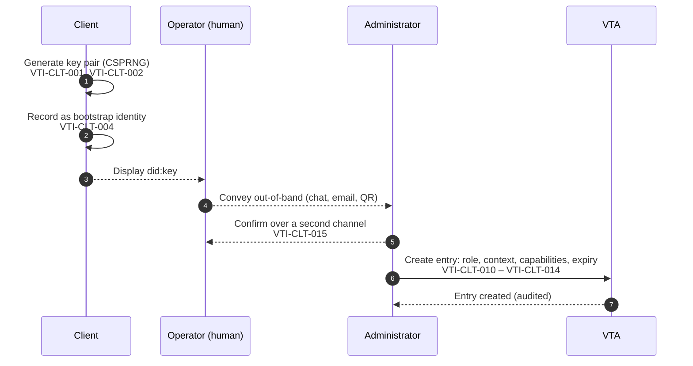
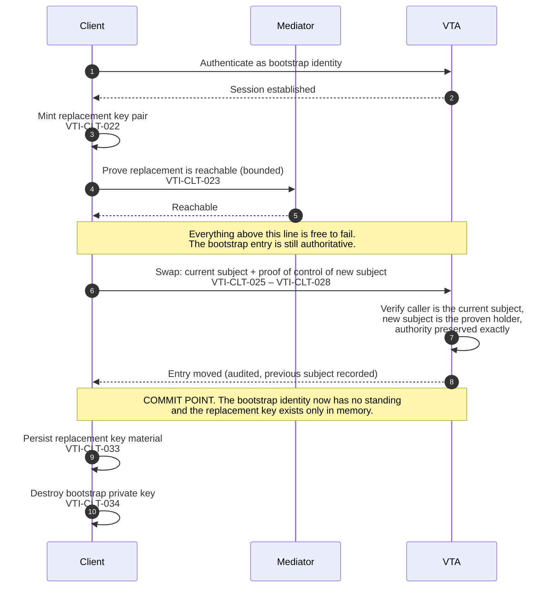

## Appendices

### Appendix A: Client onboarding

This appendix is informative. It illustrates the sequence specified in the
Client Onboarding and Lifecycle chapter, and supplies test vectors for the
parts of it that are decidable without a running node.

#### A.1 Enrolment



The out-of-band hop is the exposed step, and the threat there is substitution
rather than disclosure — which is why step 5 exists, and why a client that
authenticates and finds no entry has to say so distinguishably (VTI-CLT-016)
rather than reporting an ordinary failure to connect.

#### A.2 First connection and the key roll



Nothing optional may be placed between the commit point and the persist. The
window cannot be removed, so the requirement is that nothing is put inside it.

#### A.3 Worked example

An AI-agent runtime is to summarise documents in one team's context and sign
nothing else.

| Step | Value |
|---|---|
| Bootstrap identity | `did:key:z6Mk…` minted by the runtime on first start |
| Context | `acme/eng/team-a/summariser` — a leaf per purpose |
| Role | the least role whose ceiling contains the capabilities below |
| Capabilities | the read capability for the document store, and per-envelope task signing; nothing that mints a session credential or reaches the generic signing oracle |
| Expiry | 30 days |
| Approve scope | none |

The context is a leaf of its own rather than `acme/eng/team-a`, because
authority over a context reaches every descendant, and a grant at the team
level would reach every purpose the team ever adds beneath it.

#### A.4 Failure cases around the commit point

| Failure | State afterwards | What the client does |
|---|---|---|
| Key generation fails | No change | Retry; nothing was communicated |
| Enrolment never happens | No entry | Authentication is refused for want of an entry; report distinguishably (VTI-CLT-016) |
| Reachability probe fails or times out | Bootstrap entry still authoritative | Report and retry when the transport is available (VTI-CLT-024, VTI-CLT-035) |
| Swap refused (authority would change) | Bootstrap entry still authoritative | Do not retry as a transport failure; the request was wrong (VTI-CLT-029, VTI-CLT-043) |
| Swap request lost, no reply | Unknown: the swap may have committed | Re-authenticate; if the replacement identifier has standing the swap committed, and the persisted key decides recoverability |
| Crash after commit, before persist | Entry moved; replacement key lost | Unrecoverable for this client. Re-enrol (VTI-CLT-054). This is the case VTI-CLT-033 exists to make as small as possible |

#### A.5 Test vectors — context paths

Valid (VTI-CTX-010 – VTI-CTX-013):

| Path | Note |
|---|---|
| `acme` | single segment |
| `acme/eng` | two segments |
| `acme/eng/team-a` | hyphen in a segment |
| `a.b_c/d-e` | full stop, low line, hyphen |
| `acme/..` | `..` is an ordinary segment name (VTI-CTX-014) |
| `s1/s2/s3/s4/s5/s6/s7/s8` | eight segments, the maximum |

Invalid:

| Path | Violates |
|---|---|
| *(empty)* | VTI-CTX-010 |
| `/acme` | leading separator, VTI-CTX-012 |
| `acme/` | trailing separator, VTI-CTX-012 |
| `acme//eng` | doubled separator, VTI-CTX-012 |
| `acme/ev il` | space in a segment, VTI-CTX-011 |
| `acme/eng/` + 65-byte segment | segment length, VTI-CTX-011 |
| `s1/s2/s3/s4/s5/s6/s7/s8/s9` | nine segments, VTI-CTX-013 |

#### A.6 Test vectors — ancestry

`is_ancestor_or_self(a, d)`, per VTI-CTX-016:

| a | d | Result | Note |
|---|---|---|---|
| `acme` | `acme` | true | self |
| `acme` | `acme/eng` | true | descendant |
| `acme` | `acme/eng/team-a` | true | deeper descendant |
| `acme/eng` | `acme` | false | ancestry is not symmetric |
| `acme` | `acme-evil` | **false** | shares a leading substring, not a leading segment |
| `acme` | `acme-evil/eng` | **false** | as above |
| `acme/eng` | `acme/engineering` | **false** | segment-wise, not prefix-wise |
| `ACME` | `acme/eng` | false | comparison is octet by octet (VTI-CTX-015) |

An implementation that returns true for any row marked **false** has the defect
VTI-CTX-016 exists to prevent.

#### A.7 Test vectors — act scope

Per VTI-ACL-020 and VTI-ACL-021, act scope is stated, not derived:

| `act` | `role` | Result | Note |
|---|---|---|---|
| `"all"` | administrative | acts in every context | a super-administrator |
| `"all"` | non-administrative | acts in every context, bounded by the role's ceiling | scope and role are independent (VTI-ACL-023) |
| `["acme/eng"]` | administrative | `acme/eng` and descendants | a context administrator |
| `["acme/eng"]` | non-administrative | `acme/eng` and descendants | |
| `["acme/eng", "beta"]` | any | both subtrees | |
| `"none"` | any | acts nowhere | valid, and the shape of a least-privilege approver |
| `[]` | any | **refused** | an empty list is not an act scope (VTI-ACL-021) |
| *(absent)* | any | **refused** | authority is stated, never defaulted (VTI-ACL-008, VTI-ACL-023) |

The last two rows are the ones a test suite is most likely to omit and most
needs. An implementation that accepts either — resolving it to any scope at all
— has reintroduced the inference this model removes.

### Appendix B: Access control entry

This appendix is informative, and illustrates the requirements in the Trust
Contexts and the Authority Model chapter.

A representative entry:

```json
{
  "subject": "did:key:z6MkexampleClientIdentifier",
  "role": "reader",
  "act": ["acme/eng/team-a/summariser"],
  "capabilities": ["vault-read", "sign-trust-task"],
  "keys": ["key-3f2a"],
  "approve": "none",
  "stepUp": { "require": "consent", "approver": "acme-approvers" },
  "expiresAt": "2026-10-10T00:00:00Z",
  "label": "summariser agent, laptop",
  "createdAt": "2026-09-10T09:14:00Z",
  "createdBy": "did:webvh:example.com:acme-admin",
  "ext": {}
}
```

| Member | Meaning | Rule |
|---|---|---|
| `subject` | the party the entry authorizes | VTI-ACL-002; stored under a one-way function where possible (VTI-ACL-009) |
| `role` | the capability ceiling | VTI-ACL-010; an unrecognised role confers nothing (VTI-ACL-011) |
| `act` | where the subject may make a change: `"all"`, `"none"`, or a non-empty list | stated, never inferred (VTI-ACL-020, VTI-ACL-021, VTI-ACL-023) |
| `capabilities` | narrowing within the ceiling | VTI-ACL-030, VTI-ACL-031 |
| `keys` | which keys the subject may reach: `"all"`, `"none"`, or a non-empty list | VTI-ACL-006, VTI-ACL-007 |
| `approve` | where the subject may bless another's change | independent of `act` (VTI-ACL-040) |
| `stepUp` | an additional-human requirement carried on the entry | Approvals section |
| `expiresAt` | when the entry stops conferring | evaluated at every decision (VTI-ACL-004) |
| `createdAt` / `createdBy` | provenance | VTI-ACL-002 |
| `ext` | ecosystem-defined content | confers no authority (VTI-ACL-005) |

Every authority-bearing member is a three-valued statement rather than a
collection whose emptiness carries meaning. `"act": []` is not a narrower grant
than `"act": ["acme"]`; it is a malformed entry, and so is an entry with no
`act` member at all. The same holds for `keys` and `approve`.

This shape is deliberately more verbose than the encoding it replaces, in which
authority was recovered by pairing a role with a possibly-empty list. The
verbosity is the point: a member that says `"none"` cannot be mistaken for a
member that says `"all"`, and neither can be produced by a serializer's default.

### Appendix C: Role and capability annex

This appendix is informative. **The contents are a proposal for working-group
ratification**; the normative requirements that reference it (VTI-ACL-010,
VTI-ACL-011, VTI-ACL-030 through VTI-ACL-034) are written so that the annex can
be settled without changing them.

#### C.1 Roles

| Role | Position |
|---|---|
| `administrator` | administers the contexts in scope, including the entries within them |
| `initiator` | initiates operations that change state within scope |
| `application` | a non-human consumer performing a defined function |
| `reader` | reads within scope; changes nothing |
| `monitor` | the least-privileged role; the safe default for an unspecified entry |

#### C.2 Capability registry

| Capability | Gates |
|---|---|
| `vault-read` | reading stored credentials and secrets |
| `vault-write` | receiving credentials and writing stored secrets |
| `credential-write` | changing the archival lifecycle of a stored credential |
| `sign` | the generic signing oracle |
| `sign-trust-task` | per-envelope task signing only |
| `proxy-login` | minting a session credential on the principal's behalf |
| `fill-release` | releasing a stored value into an authorized flow |
| `key-mint` | creating new keys within scope |
| `policy-admin` | changing policy, including approval rules |
| `device-admin` | enrolling and managing devices |
| `memory-read` | reading agent memory |
| `memory-write` | writing or deleting agent memory |
| `holder` *(additive)* | acting for the holder over their own identity across every context |

`holder` is marked additive because no role implies it: it reaches above the
context tree rather than within it, so deriving it from an administrative role
would hand it to every context administrator on upgrade. Granting it requires
unrestricted act authority (VTI-ACL-033).

The separations in this table are deliberate and each has a reason worth
keeping: `sign-trust-task` exists so that an agent can sign an envelope without
holding the generic oracle; `credential-write` exists so that a consumer can
receive credentials without being able to destroy them; `memory-read` and
`memory-write` are split so that a read-only consumer of a context cannot
rewrite what it reads.

### Appendix D: Context path grammar

This appendix is normative. It states the grammar referenced by VTI-CTX-010
through VTI-CTX-013.

```abnf
context-path  = segment *7( "/" segment )
segment       = 1*64( segment-char )
segment-char  = ALPHA / DIGIT / "." / "_" / "-"
```

`ALPHA` and `DIGIT` are as defined in [IETF RFC 5234]. The repetition limits
carry two of the constraints directly: a path holds between one and eight
segments, and a segment holds between one and sixty-four characters. Because
`/` cannot appear inside a segment, the grammar admits no leading, trailing or
doubled separator, and no empty segment.

**Ancestry.** Let `segments(x)` be the ordered sequence of segments of a valid
context path `x`. A path `a` is an *ancestor-or-self* of a path `d` exactly
when `segments(a)` is a prefix of `segments(d)`, where segments are compared
octet by octet (VTI-CTX-015).

Note that ancestry is defined over the segment sequences and not over the
strings: `acme` is an ancestor-or-self of `acme/eng` and of `acme`, and is not
an ancestor of `acme-evil`, which shares a leading substring but not a leading
segment. See VTI-CTX-016.

### Appendix E: Composition proposition catalogue

This appendix is informative, and is the record required by VTI-CMP-120.

Each requirement in the Composition Requirements chapter is recorded here with
its ownership classification, the evidence supporting it, the legitimate
counter-cases considered, and a pointer to any executable pressure test.

#### Ownership classification

| Classification | Meaning |
|---|---|
| `COMPONENT-OWNED` | The requirement belongs to a component specification, and appears here only as a cross-reference. |
| `COMPOSITION-OWNED` | No component can establish it; this specification owns it. |
| `JOINTLY-OWNED` | A component owns the underlying semantics, and this specification owns their survival across composition. |
| `ASSURANCE-ONLY` | Not a normative requirement on an implementation; a property an assessment programme examines. |
| `UNRESOLVED` | Supported by evidence, not yet resolved to an owner. Published with that status visible. |

`JOINTLY-OWNED` carries most of the difficulty. A component specification may
properly own the semantics of authority, delegation, lifecycle state, privacy,
provenance or evidence, while the question of whether those semantics survive a
multi-component interaction belongs here. Recording a requirement as jointly
owned is not a step toward moving it into this specification.

#### Evidence families

{{Each family records a set of related propositions carried through the same
path: threat proposition, falsifiable invariant, executable pressure test,
legitimate counter-case, disposition. Families are added as the evidence is
produced.}}

**Family 1 — false independence.** Seven threat classes sharing one unsafe
inference, each with an executable test and a legitimate counter-case. Supports
VTI-CMP-070 through VTI-CMP-074.

| Threat class | Preserved judgment |
|---|---|
| Sybil | multiplicity is not independence |
| False diversity | nominal diversity is not governance independence |
| Trust laundering | provenance depth is not assurance depth |
| Sock puppet | persona multiplicity is not social independence |
| Quorum capture | threshold arithmetic is not independent or legitimate approval |
| Collusion | distinct actors are not necessarily independent actors |
| Selective evidence | valid evidence is not necessarily complete evidence |

Corpus-level result: apparent multiplicity, depth, threshold satisfaction, actor
distinctness or artefact validity is not evidence independence or evidence
completeness. The corpus equally preserves the opposite boundary — legitimate
plurality, pseudonymity, shared infrastructure, transformation, coalitions,
independent agreement, selective disclosure and privacy-preserving minimisation
are not failures merely for resembling an adversarial pattern (VTI-CMP-074).

{{Current disposition: `UNRESOLVED`, with strong `COMPOSITION-OWNED` evidence.
Source material is cited in the Informative References.}}

#### Assessment submissions

{{Submissions received under the assessment interface defined in the
Conformance chapter, each citing a requirement identifier, a disposition of
`supported`, `refuted` or `indeterminate`, the method and artefacts, and the
assessor and date. Where two submissions disagree, both are recorded.}}

### Appendix F: Divergence register

This appendix is informative. It records known differences between this
specification and implementations, per VTI-CNF-015.

An entry states what the specification requires, what an implementation is
reported to do instead, and the resolution. **An entry is a statement about an
implementation, never a qualification of a requirement** (VTI-CNF-014): an
implementation listed here does not conform to the requirement listed beside
it. Entries are contributed by implementers and by the working group, and are
removed when the divergence is closed.

The register is deliberately part of the specification rather than a separate
document. A divergence that is written down is one an evaluator can ask about
and a maintainer can plan against; a divergence that is only known is one that
gets rediscovered by whoever is composing the system next.

Each entry states how it was established. An entry marked *reported* rests on a
maintainer's account; one marked *observed* rests on an inspection of a running
implementation's source at a stated point in time. An entry marked *open*
records a requirement whose status has not been established, which is a
different thing from a requirement that is met.

#### F.1 Authority encoding

| Requirement | This specification requires | Reported behaviour | Resolution |
|---|---|---|---|
| VTI-ACL-020, VTI-ACL-021, VTI-ACL-023 | Act scope stated explicitly as `all`, `none`, or a non-empty list, independent of role | Act scope recovered from the pair (role, context list), where an empty list means *unrestricted* for an administrative role and *nowhere* for every other | Add the explicit member to the stored and transmitted forms; refuse an empty list on write; retain the derivation only for reading entries written before the migration |
| VTI-ACL-006, VTI-ACL-007, VTI-ACL-008 | Key narrowing stated explicitly as `all`, `none`, or a non-empty list | Absent and present-but-empty distinguished by serializer discipline, with absent meaning every reachable key | Add the explicit member; treat absent as malformed once written entries have been migrated |
| VTI-ACL-061 | A context-filtered listing without a direction is refused | An absent direction is treated as `acting-in` | Require the direction; a transition may warn before refusing, but MUST NOT ship as the long-term behaviour |
| VTI-ACL-060 | Every context-filtered listing can express both directions | At least one canonical listing operation defines no direction member, and its payload is closed, so the subtree question cannot be asked through it at all | A change to the operation definition; until then a subtree sweep cannot be performed through that operation and MUST NOT be reported as complete |
| VTI-ACL-066 | A pagination cursor binds the direction it was minted under | At least one paginated listing does not bind direction, so a resumed listing can change question mid-sweep | Include the direction in the cursor binding and refuse a mismatched resume |

#### F.2 Operations and versioning

| Requirement | This specification requires | Reported behaviour | Resolution |
|---|---|---|---|
| VTI-OPS-021 | Document addressing and proof on every transport | Addressing and signing applied on the transports without sender authentication, and omitted on those with it | Apply uniformly; the transport's own authentication is not a substitute |
| VTI-OPS-041, VTI-OPS-042 | A breaking change increments the major version, at every version number, including changes to permitted values | Catalogues published below 1.0 relying on the `0.x` exemption; changes to enumerated values shipped as minor increments | Drop the exemption; re-publish affected families at a major increment |
| VTI-OPS-043 – VTI-OPS-045 | Served versions published, a common version selected, and an unsupported version refused explicitly | Discovery exists; run-time selection does not. An unsupported version surfaces as a timeout on asynchronous transports | Implement selection, and refuse explicitly naming the versions served |
| VTI-CLT-026 | The rotation request carries proof of control of the replacement identifier | The proof is optional in the operation definition and required by deployment policy | Make it required in the definition; a security property that depends on configuration is not a property |
| VTI-OPS-026, VTI-OPS-027 *(observed)* | A repeat of an accepted document is refused, and the record of accepted identifiers is shared across bindings | Documents carry a unique identifier, and nothing consults it. De-duplication is keyed on a caller-supplied idempotency key, applies only to operations classified as keyed, and returns the recorded response rather than refusing | Reject a repeated document identifier within the acceptance window, in a record shared by every binding. The identifier is already on the wire, so this is a consumer-side change |
| VTI-OPS-046, VTI-OPS-047 *(open)* | Discovery responses are authenticated, and each operation has a version floor a peer cannot argue a node below | Not established | Determine whether discovery is authenticated on each binding, and whether a floor exists |

#### F.3 Transports, sessions and resolution

| Requirement | This specification requires | Reported behaviour | Resolution |
|---|---|---|---|
| VTI-TRN-052, VTI-TRN-053 | Reachability is re-falsifiable; health reports current ability to send | Reachability latched at start-up in some components; health reporting last-known state | Re-evaluate on use and on failure |
| VTI-SES-042 | Where a session is bound to a client-held key, a request that does not demonstrate the key is refused | The binding is honoured by some services and silently ignored by others that accept the field | Implement uniformly, or refuse the field where it is not enforced. Accepting a security parameter and ignoring it is worse than not offering it |
| VTI-KEY-061 | Negative resolution results cached briefly, and never when the failure was a transport failure | Long-lived negative caching that does not distinguish the two | Bound the lifetime; never cache a transport failure |

#### F.4 Signing, audit and identifiers

| Requirement | This specification requires | Reported behaviour | Resolution |
|---|---|---|---|
| VTI-VTA-004, VTI-VTA-005 *(observed)* | A signing oracle parses and constrains what it signs, and refuses opaque octets | The constrained path validates the envelope's shape, its issuer against the entry's principal, the absence of a prior proof, and expiry. A second, general path signs an arbitrary octet string under a separate capability, subject to key and context authorization but to no structural constraint | Constrain or retire the general path. Key-level and context-level authorization bound *which key* signs, not *what is signed*, and blind signing is what turns a delegated capability into a general forgery capability for the principal |
| VTI-SES-007 *(observed)* | A challenge refusal does not reveal whether an entry exists | The challenge path resolves the caller's entry first and refuses on absence, so a request for an unknown subject is distinguishable from one for a known subject | Make the refusal uniform, and rate-limit by source as well as by subject. The client's own signal is what reaches its operator (VTI-CLT-016) |
| VTI-SES-042 *(observed)* | Where a session is bound to a client-held key, a request that does not demonstrate the key is refused | The binding member exists in the authentication input and is set to absent at every call site of one node type, so a value supplied by a client is accepted and discarded | Enforce the binding, or refuse the member. Accepting a security parameter and ignoring it is worse than not offering it, because a client cannot tell the difference |
| VTI-AUD-004 *(observed)* | The audit trail is tamper-evident | One node type chains each entry to its predecessor by digest; another's default sink is flat and unchained, so a compromised node can rewrite its own history undetectably. The pluggable sink admits a chained backend; the default is not one | Chain by default. A tamper-evidence property that depends on the operator having installed something is not a property of the deployment |
| VTI-AUD-005 *(observed)* | An audit record refers to personal data rather than embedding it, so erasure leaves the chain verifiable | Records embed subject identifiers directly. Where the log is chained, an erasure breaks the chain; where it is not, the erasure is undetectable | Commit to a reference or a salted digest. This is the entry most worth resolving before a deployment carries personal data at scale, because it cannot be fixed retroactively for records already written |
| VTI-AUD-006 *(open)* | Reading the audit trail is authorized and audited | The read operation exists; whether the read is itself recorded has not been established | Establish, and record the read |
| VTI-KEY-006 *(observed)* | A client identifier is not reused across trust contexts | A client holds one identifier per node it is enrolled with, used in every context that entry is scoped to | Derive a client identifier per context, or scope a client to one context. Until then a node can link a client's activity across every context it reaches, and so can anything that observes two of them |
| VTI-KEY-013, VTI-TRN-026, VTI-APV-013 *(open)* | Retirable algorithms; per-relationship routing identifiers; the approver sees the octets that are digested | Not established | Establish each. VTI-APV-013 is the one to establish first: it is the requirement whose failure is invisible to everyone including the approver |

#### F.5 How to add an entry

An entry needs the requirement identifier, how the behaviour was established,
the behaviour itself, and the intended resolution. It does not need the implementation to be named — the
register describes behaviour so that it is useful to every implementer facing
the same question — and it does not need the divergence to be resolved before
it is recorded.

Where a divergence is evidence that the requirement itself is wrong rather than
the implementation, that is a change proposal against the requirement, not an
entry here. Both are welcome; they are different things, and conflating them is
how a register turns into a set of exemptions.

### Appendix G: Acknowledgements

{{The final appendix should contain any additional acknowledgements}}

Copyright © 2026 Trust Over IP (ToIP) Contributors  
This work is licensed under a Creative Commons Attribution 4.0 International License.
