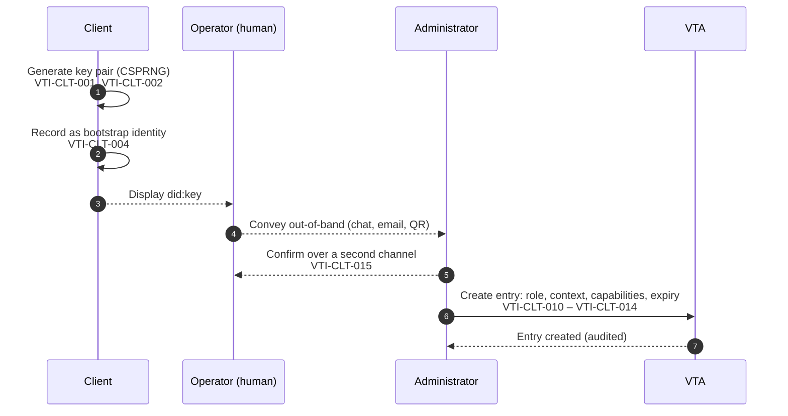
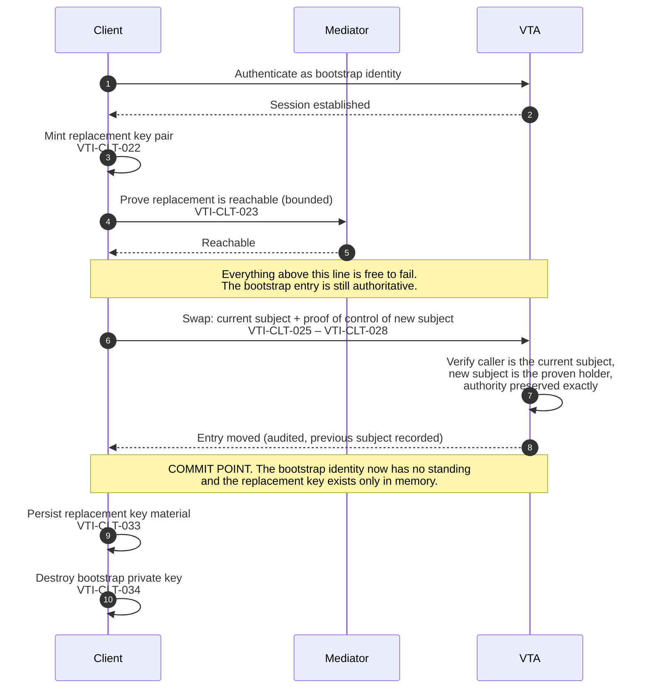

## Appendices

### Appendix A: Client onboarding

This appendix is informative. It illustrates the sequence specified in the
Client Onboarding and Lifecycle chapter, and supplies test vectors for the
parts of it that are decidable without a running node.

#### A.1 Enrolment



The out-of-band hop is the exposed step, and the threat there is substitution
rather than disclosure — which is why step 5 exists, and why a client that
authenticates and finds no entry has to say so distinguishably (VTI-CLT-016)
rather than reporting an ordinary failure to connect.

#### A.2 First connection and the key roll



Nothing optional may be placed between the commit point and the persist. The
window cannot be removed, so the requirement is that nothing is put inside it.

#### A.3 Worked example

An AI-agent runtime is to summarise documents in one team's context and sign
nothing else.

| Step | Value |
|---|---|
| Bootstrap identity | `did:key:z6Mk…` minted by the runtime on first start |
| Context | `acme/eng/team-a/summariser` — a leaf per purpose |
| Role | the least role whose ceiling contains the capabilities below |
| Capabilities | the read capability for the document store, and per-envelope task signing; nothing that mints a session credential or reaches the generic signing oracle |
| Expiry | 30 days |
| Approve scope | none |

The context is a leaf of its own rather than `acme/eng/team-a`, because
authority over a context reaches every descendant, and a grant at the team
level would reach every purpose the team ever adds beneath it.

#### A.4 Failure cases around the commit point

| Failure | State afterwards | What the client does |
|---|---|---|
| Key generation fails | No change | Retry; nothing was communicated |
| Enrolment never happens | No entry | Authentication is refused for want of an entry; report distinguishably (VTI-CLT-016) |
| Reachability probe fails or times out | Bootstrap entry still authoritative | Report and retry when the transport is available (VTI-CLT-024, VTI-CLT-035) |
| Swap refused (authority would change) | Bootstrap entry still authoritative | Do not retry as a transport failure; the request was wrong (VTI-CLT-029, VTI-CLT-043) |
| Swap request lost, no reply | Unknown: the swap may have committed | Re-authenticate; if the replacement identifier has standing the swap committed, and the persisted key decides recoverability |
| Crash after commit, before persist | Entry moved; replacement key lost | Unrecoverable for this client. Re-enrol (VTI-CLT-054). This is the case VTI-CLT-033 exists to make as small as possible |

#### A.5 Test vectors — context paths

Valid (VTI-CTX-010 – VTI-CTX-013):

| Path | Note |
|---|---|
| `acme` | single segment |
| `acme/eng` | two segments |
| `acme/eng/team-a` | hyphen in a segment |
| `a.b_c/d-e` | full stop, low line, hyphen |
| `acme/..` | `..` is an ordinary segment name (VTI-CTX-014) |
| `s1/s2/s3/s4/s5/s6/s7/s8` | eight segments, the maximum |

Invalid:

| Path | Violates |
|---|---|
| *(empty)* | VTI-CTX-010 |
| `/acme` | leading separator, VTI-CTX-012 |
| `acme/` | trailing separator, VTI-CTX-012 |
| `acme//eng` | doubled separator, VTI-CTX-012 |
| `acme/ev il` | space in a segment, VTI-CTX-011 |
| `acme/eng/` + 65-byte segment | segment length, VTI-CTX-011 |
| `s1/s2/s3/s4/s5/s6/s7/s8/s9` | nine segments, VTI-CTX-013 |

#### A.6 Test vectors — ancestry

`is_ancestor_or_self(a, d)`, per VTI-CTX-016:

| a | d | Result | Note |
|---|---|---|---|
| `acme` | `acme` | true | self |
| `acme` | `acme/eng` | true | descendant |
| `acme` | `acme/eng/team-a` | true | deeper descendant |
| `acme/eng` | `acme` | false | ancestry is not symmetric |
| `acme` | `acme-evil` | **false** | shares a leading substring, not a leading segment |
| `acme` | `acme-evil/eng` | **false** | as above |
| `acme/eng` | `acme/engineering` | **false** | segment-wise, not prefix-wise |
| `ACME` | `acme/eng` | false | comparison is octet by octet (VTI-CTX-015) |

An implementation that returns true for any row marked **false** has the defect
VTI-CTX-016 exists to prevent.

#### A.7 Test vectors — act scope

Per VTI-ACL-020 and VTI-ACL-021, act scope is stated, not derived:

| `act` | `role` | Result | Note |
|---|---|---|---|
| `"all"` | administrative | acts in every context | a super-administrator |
| `"all"` | non-administrative | acts in every context, bounded by the role's ceiling | scope and role are independent (VTI-ACL-023) |
| `["acme/eng"]` | administrative | `acme/eng` and descendants | a context administrator |
| `["acme/eng"]` | non-administrative | `acme/eng` and descendants | |
| `["acme/eng", "beta"]` | any | both subtrees | |
| `"none"` | any | acts nowhere | valid, and the shape of a least-privilege approver |
| `[]` | any | **refused** | an empty list is not an act scope (VTI-ACL-021) |
| *(absent)* | any | **refused** | authority is stated, never defaulted (VTI-ACL-008, VTI-ACL-023) |

The last two rows are the ones a test suite is most likely to omit and most
needs. An implementation that accepts either — resolving it to any scope at all
— has reintroduced the inference this model removes.

### Appendix B: Access control entry

This appendix is informative, and illustrates the requirements in the Access
Control and Authority chapter.

A representative entry:

```json
{
  "subject": "did:key:z6MkexampleClientIdentifier",
  "role": "reader",
  "act": ["acme/eng/team-a/summariser"],
  "capabilities": ["vault-read", "sign-trust-task"],
  "keys": ["key-3f2a"],
  "approve": "none",
  "stepUp": { "require": "consent", "approver": "acme-approvers" },
  "expiresAt": "2026-10-10T00:00:00Z",
  "label": "summariser agent, laptop",
  "createdAt": "2026-09-10T09:14:00Z",
  "createdBy": "did:webvh:example.com:acme-admin",
  "ext": {}
}
```

| Member | Meaning | Rule |
|---|---|---|
| `subject` | the party the entry authorizes | VTI-ACL-002; stored under a one-way function where possible (VTI-ACL-009) |
| `role` | the capability ceiling | VTI-ACL-010; an unrecognised role confers nothing (VTI-ACL-011) |
| `act` | where the subject may make a change: `"all"`, `"none"`, or a non-empty list | stated, never inferred (VTI-ACL-020, VTI-ACL-021, VTI-ACL-023) |
| `capabilities` | narrowing within the ceiling | VTI-ACL-030, VTI-ACL-031 |
| `keys` | which keys the subject may reach: `"all"`, `"none"`, or a non-empty list | VTI-ACL-006, VTI-ACL-007 |
| `approve` | where the subject may bless another's change | independent of `act` (VTI-ACL-040) |
| `stepUp` | an additional-human requirement carried on the entry | Approvals section |
| `expiresAt` | when the entry stops conferring | evaluated at every decision (VTI-ACL-004) |
| `createdAt` / `createdBy` | provenance | VTI-ACL-002 |
| `ext` | ecosystem-defined content | confers no authority (VTI-ACL-005) |

Every authority-bearing member is a three-valued statement rather than a
collection whose emptiness carries meaning. `"act": []` is not a narrower grant
than `"act": ["acme"]`; it is a malformed entry, and so is an entry with no
`act` member at all. The same holds for `keys` and `approve`.

This shape is deliberately more verbose than the encoding it replaces, in which
authority was recovered by pairing a role with a possibly-empty list. The
verbosity is the point: a member that says `"none"` cannot be mistaken for a
member that says `"all"`, and neither can be produced by a serializer's default.

### Appendix C: Role and capability annex

This appendix is informative. **The contents are a proposal for working-group
ratification**; the normative requirements that reference it (VTI-ACL-010,
VTI-ACL-011, VTI-ACL-030 through VTI-ACL-034) are written so that the annex can
be settled without changing them.

#### C.1 Roles

| Role | Position |
|---|---|
| `administrator` | administers the contexts in scope, including the entries within them |
| `initiator` | initiates operations that change state within scope |
| `application` | a non-human consumer performing a defined function |
| `reader` | reads within scope; changes nothing |
| `monitor` | the least-privileged role; the safe default for an unspecified entry |

#### C.2 Capability registry

| Capability | Gates |
|---|---|
| `vault-read` | reading stored credentials and secrets |
| `vault-write` | receiving credentials and writing stored secrets |
| `credential-write` | changing the archival lifecycle of a stored credential |
| `sign` | the generic signing oracle |
| `sign-trust-task` | per-envelope task signing only |
| `proxy-login` | minting a session credential on the principal's behalf |
| `fill-release` | releasing a stored value into an authorized flow |
| `key-mint` | creating new keys within scope |
| `policy-admin` | changing policy, including approval rules |
| `device-admin` | enrolling and managing devices |
| `memory-read` | reading agent memory |
| `memory-write` | writing or deleting agent memory |
| `holder` *(additive)* | acting for the holder over their own identity across every context |

`holder` is marked additive because no role implies it: it reaches above the
context tree rather than within it, so deriving it from an administrative role
would hand it to every context administrator on upgrade. Granting it requires
unrestricted act authority (VTI-ACL-033).

The separations in this table are deliberate and each has a reason worth
keeping: `sign-trust-task` exists so that an agent can sign an envelope without
holding the generic oracle; `credential-write` exists so that a consumer can
receive credentials without being able to destroy them; `memory-read` and
`memory-write` are split so that a read-only consumer of a context cannot
rewrite what it reads.

### Appendix D: Context path grammar

This appendix is normative. It states the grammar referenced by VTI-CTX-010
through VTI-CTX-013.

```abnf
context-path  = segment *7( "/" segment )
segment       = 1*64( segment-char )
segment-char  = ALPHA / DIGIT / "." / "_" / "-"
```

`ALPHA` and `DIGIT` are as defined in [IETF RFC 5234]. The repetition limits
carry two of the constraints directly: a path holds between one and eight
segments, and a segment holds between one and sixty-four characters. Because
`/` cannot appear inside a segment, the grammar admits no leading, trailing or
doubled separator, and no empty segment.

**Ancestry.** Let `segments(x)` be the ordered sequence of segments of a valid
context path `x`. A path `a` is an *ancestor-or-self* of a path `d` exactly
when `segments(a)` is a prefix of `segments(d)`, where segments are compared
octet by octet (VTI-CTX-015).

Note that ancestry is defined over the segment sequences and not over the
strings: `acme` is an ancestor-or-self of `acme/eng` and of `acme`, and is not
an ancestor of `acme-evil`, which shares a leading substring but not a leading
segment. See VTI-CTX-016.

### Appendix E: Composition proposition catalogue

This appendix is the record required by VTI-CMP-120. Section E.1 is
normative: it fixes the form of that record and the classification vocabulary,
which VTI-CMP-002 and VTI-CMP-120 rely on. The remainder of the appendix is
informative — it is the record itself, and its content changes as evidence is
produced without changing any requirement.

#### E.1 Record form

This section is normative.

Each requirement in the Composition Requirements chapter is recorded in this
appendix. A record consists of:

- the requirement identifier or identifiers it covers;
- an ownership classification, which is exactly one of the values in the table
  below;
- the evidence supporting the requirement;
- the legitimate counter-cases considered — behaviour that resembles the
  failure the requirement prevents but is not one;
- a pointer to each executable pressure test, or a statement that none is
  published; and
- the current disposition.

Several requirements supported by the same evidence may share one record, as
the evidence families in E.2 do.

| Classification | Meaning |
|---|---|
| `COMPONENT-OWNED` | The requirement belongs to a component specification, and appears here only as a cross-reference. |
| `COMPOSITION-OWNED` | No component can establish it; this specification owns it. |
| `JOINTLY-OWNED` | A component owns the underlying semantics, and this specification owns their survival across composition. |
| `ASSURANCE-ONLY` | Not a normative requirement on an implementation; a property an assessment programme examines. |
| `UNRESOLVED` | Supported by evidence, not yet resolved to an owner. Published with that status visible. |

`JOINTLY-OWNED` carries most of the difficulty. A component specification may
properly own the semantics of authority, delegation, lifecycle state, privacy,
provenance or evidence, while the question of whether those semantics survive a
multi-component interaction belongs here. Recording a requirement as jointly
owned is not a step toward moving it into this specification.

#### E.2 Evidence families

This section is informative.

Each family is a record in the form of E.1. It carries a set of related
propositions through the same path: threat proposition, falsifiable invariant,
executable pressure test, legitimate counter-case, disposition. Families are
added as the evidence is produced.

**Family 1 — false independence.** Seven threat classes sharing one unsafe
inference, each with an executable test and a legitimate counter-case. Supports
VTI-CMP-070 through VTI-CMP-074.

| Threat class | Preserved judgment |
|---|---|
| Sybil | multiplicity is not independence |
| False diversity | nominal diversity is not governance independence |
| Trust laundering | provenance depth is not assurance depth |
| Sock puppet | persona multiplicity is not social independence |
| Quorum capture | threshold arithmetic is not independent or legitimate approval |
| Collusion | distinct actors are not necessarily independent actors |
| Selective evidence | valid evidence is not necessarily complete evidence |

Corpus-level result: apparent multiplicity, depth, threshold satisfaction, actor
distinctness or artefact validity is not evidence independence or evidence
completeness. The corpus equally preserves the opposite boundary — legitimate
plurality, pseudonymity, shared infrastructure, transformation, coalitions,
independent agreement, selective disclosure and privacy-preserving minimisation
are not failures merely for resembling an adversarial pattern (VTI-CMP-074).

Current disposition: `UNRESOLVED`, with strong `COMPOSITION-OWNED` evidence.
Source material is cited in the Informative References.

**Family 2 — validity is not completion.** One unsafe inference: that a
credential citing a Trust Task exchange, having verified, shows the exchange
completed. Supports VTI-CMP-022, VTI-CMP-023 and VTI-CMP-064.

| Proposition | Pressure test | Legitimate counter-case |
|---|---|---|
| A credential verifies in full for an exchange that never completed | A statement credential passing signature, status, predicate and every profile constraint, citing a session with no terminal document | A credential that cites an exchange only to identify it, not as evidence it completed, is not a failure |
| Outcome evidence of the wrong kind reads as completion | A cancelled session's control response, a response signed by the holder itself, an error response, and a counterfeit initiating document reusing the cited `id`, each checked against the pairing rule | An exchange closed by the response to a task conducted on its thread under another specification is complete when that response is the declared outcome evidence |
| Completion evidence is private because the credential's proof is | Outcome evidence carried beside a selectively disclosed credential, measured for the identifiers it discloses | A relying decision that does not depend on completion needs no outcome evidence, and carries none |

Ownership: `JOINTLY-OWNED` — [DTG-CRED] owns credential validity and
[TRUST-TASKS] owns the outcome-evidence checks; whether a relying party keeps
the two apart holds only across their composition. Executable pressure test for
the second proposition: [KEYRING-REF-07G], which runs four pairing rules
against seven exchanges built from real Trust Task documents and proofs. The
first and third propositions have no published pressure test yet.

Current disposition: `UNRESOLVED`, with `JOINTLY-OWNED` evidence.

#### E.3 Assessment submissions

This section is informative.

Submissions received under the assessment interface defined in the Conformance
chapter are recorded here, each citing a requirement identifier, a disposition
of `supported`, `refuted` or `indeterminate`, the method and artefacts, and the
assessor and date. Where two submissions disagree, both are recorded.

None have been received at the time of publication. An empty section here means
no programme has submitted evidence, and not that evidence was sought and none
found.

### Appendix F: Divergence register

This appendix is informative. It records known differences between this
specification and implementations, per VTI-CNF-015.

An entry states what the specification requires, what an implementation is
reported to do instead, and the resolution. **An entry is a statement about an
implementation, never a qualification of a requirement** (VTI-CNF-014): an
implementation listed here does not conform to the requirement listed beside
it. Entries are contributed by implementers and by the working group, and are
removed when the divergence is closed.

The register is deliberately part of the specification rather than a separate
document. A divergence that is written down is one an evaluator can ask about
and a maintainer can plan against; a divergence that is only known is one that
gets rediscovered by whoever is composing the system next.

Each entry states how it was established. An entry marked *reported* rests on a
maintainer's account; one marked *observed* rests on an inspection of a running
implementation's source at a stated point in time. An entry marked *open*
records a requirement whose status has not been established, which is a
different thing from a requirement that is met.

#### F.1 Authority encoding

| Requirement | This specification requires | Reported behaviour | Resolution |
|---|---|---|---|
| VTI-ACL-020, VTI-ACL-021, VTI-ACL-023 | Act scope stated explicitly as `all`, `none`, or a non-empty list, independent of role | Act scope recovered from the pair (role, context list), where an empty list means *unrestricted* for an administrative role and *nowhere* for every other | Add the explicit member to the stored and transmitted forms; refuse an empty list on write; retain the derivation only for reading entries written before the migration |
| VTI-ACL-006, VTI-ACL-007, VTI-ACL-008 | Key narrowing stated explicitly as `all`, `none`, or a non-empty list | Absent and present-but-empty distinguished by serializer discipline, with absent meaning every reachable key | Add the explicit member; treat absent as malformed once written entries have been migrated |
| VTI-ACL-061 | A context-filtered listing without a direction is refused | An absent direction is treated as `acting-in` | Require the direction; a transition may warn before refusing, but MUST NOT ship as the long-term behaviour |
| VTI-ACL-060 | Every context-filtered listing can express both directions | At least one canonical listing operation defines no direction member, and its payload is closed, so the subtree question cannot be asked through it at all | A change to the operation definition; until then a subtree sweep cannot be performed through that operation and MUST NOT be reported as complete |
| VTI-ACL-066 | A pagination cursor binds the direction it was minted under | At least one paginated listing does not bind direction, so a resumed listing can change question mid-sweep | Include the direction in the cursor binding and refuse a mismatched resume |

#### F.2 Operations and versioning

| Requirement | This specification requires | Reported behaviour | Resolution |
|---|---|---|---|
| VTI-OPS-021 | Document addressing and proof on every transport | Addressing and signing applied on the transports without sender authentication, and omitted on those with it | Apply uniformly; the transport's own authentication is not a substitute |
| VTI-OPS-041, VTI-OPS-042 | A breaking change increments the major version, at every version number, including changes to permitted values | Catalogues published below 1.0 relying on the `0.x` exemption; changes to enumerated values shipped as minor increments | Drop the exemption; re-publish affected families at a major increment |
| VTI-OPS-043 – VTI-OPS-045 | Served versions published, a common version selected, and an unsupported version refused explicitly | Discovery exists; run-time selection does not. An unsupported version surfaces as a timeout on asynchronous transports | Implement selection, and refuse explicitly naming the versions served |
| VTI-CLT-026 | The rotation request carries proof of control of the replacement identifier | The proof is optional in the operation definition and required by deployment policy | Make it required in the definition; a security property that depends on configuration is not a property |
| VTI-OPS-027 *(observed, corrected)* | The record of accepted document identifiers is shared across every binding a node exposes | A replay guard claims each document identifier with its digest, on the dispatch path every binding shares, bounded by an acceptance window tied to the record's retention — so the requirement holds **within a process**. The guard is in memory, so a horizontally scaled deployment holds one record per replica and can accept the same document once per replica | Share the record across replicas. Note that the acceptance window and the retention are one bound: widening either alone reopens the gap |
| VTI-OPS-020, VTI-OPS-021, VTI-OPS-024, VTI-OPS-093 *(observed)* | Every operation document carries a proof by its issuer and a time of issue, on every binding, and a binding does not relax either on the strength of the transport's own authentication | At one community node, 45 tasks whose own definitions declare the proof REQUIRED are served over an HTTP binding that carries no operation document at all. The body is the bare payload, the task is named in a header and checked against the route, and the caller is authenticated by a bearer session token. No proof is required or verified, no time of issue is checked, although every one of these definitions except five also declares it REQUIRED, and no document identifier enters the replay record. There are 28 community tasks. Administrative: `vtc/members/{credentials, update, admin-remove, purge}`, `vtc/join-requests/decide`, `vtc/admin/invites/{create, revoke}`, `vtc/community/profile/update`, `vtc/backup/{export, import}`, `vtc/registry/sync-jobs/{retry, discard}`, `vtc/endorsement-types/{register, delete}` and `vtc/website/{files/delete, rollback}`. Taken under a member's session: `vtc/members/{renew, rotate-challenge, rotate, self-remove, personhood/assert, personhood/revoke}`, `vtc/relationships/revoke`, `vtc/endorsements/{issue, revoke}`, `vtc/invitations/{issue, revoke}` and `vtc/vetting/vetters/grant`. There are 17 canonical tasks shared with other node types: `acl/{grant, change-role, revoke}`, `config/{patch, reload, restart}`, `policy/{upsert, activate}`, `audit/list`, `auth/{whoami, sessions/list, revoke-session}` and `auth/passkey/{list, enroll/start, enroll/finish, revoke/start, revoke/finish}`. The five that do not declare the time of issue REQUIRED are `auth/whoami`, `auth/sessions/list`, `auth/passkey/list`, `auth/passkey/enroll/start` and `auth/passkey/revoke/start`. One more, `vtc/auth/admin-session`, is unauthenticated at the transport; it takes an access token in the body and also carries no proof. Eleven of the community tasks are also served by the node's document dispatcher, which holds a document to the policy its definition declares (F.7); for those the bearer route remains beside it as a transitional path, so the divergence stands for them until it is removed | Bind each of these tasks in the document dispatcher, which accepts a signed operation document, verifies its proof, checks its time of issue and records its identifier. Keep the bearer route only as a documented transitional path with a stated removal point. A token authenticates whoever presents it and not the party who composed the request, so it cannot satisfy a definition that requires a proof |
| VTI-OPS-046, VTI-OPS-047 *(open)* | Discovery responses are authenticated, and each operation has a version floor a peer cannot argue a node below | Not established | Determine whether discovery is authenticated on each binding, and whether a floor exists |

#### F.3 Transports, sessions and resolution

| Requirement | This specification requires | Reported behaviour | Resolution |
|---|---|---|---|
| VTI-TRN-052, VTI-TRN-053 | Reachability is re-falsifiable; health reports current ability to send | Reachability latched at start-up in some components; health reporting last-known state | Re-evaluate on use and on failure |
| VTI-SES-042 | Where a session is bound to a client-held key, a request that does not demonstrate the key is refused | The binding is honoured by some services and silently ignored by others that accept the field | Implement uniformly, or refuse the field where it is not enforced. Accepting a security parameter and ignoring it is worse than not offering it |
| VTI-KEY-061 | Negative resolution results cached briefly, and never when the failure was a transport failure | Long-lived negative caching that does not distinguish the two | Bound the lifetime; never cache a transport failure |

#### F.4 Signing, audit and identifiers

| Requirement | This specification requires | Reported behaviour | Resolution |
|---|---|---|---|
| VTI-SES-042 *(observed, corrected)* | Where a session is bound to a client-held key, a request that does not demonstrate the key is refused | Not implemented at one node type: its challenge request carries no such member, the internal field is set to absent at every call site, and no request path enforces a binding. The shared session type carries the member and other node types populate it, so the plumbing exists and this node does not use it | Implement the binding, or state that this node type does not offer it. This is an unimplemented SHOULD rather than a parameter accepted and ignored — the earlier entry said otherwise and was wrong |
| VTI-AUD-006 *(open)* | Reading the audit trail is authorized and audited | The read operation exists; whether the read is itself recorded has not been established | Establish, and record the read |
| VTI-KEY-006 *(observed)* | A client identifier is not reused across trust contexts | A client holds one identifier per node it is enrolled with, used in every context that entry is scoped to | Derive a client identifier per context, or scope a client to one context. Until then a node can link a client's activity across every context it reaches, and so can anything that observes two of them |
| VTI-KEY-013, VTI-TRN-026, VTI-APV-013 *(open)* | Retirable algorithms; per-relationship routing identifiers; the approver sees the octets that are digested | Not established | Establish each. VTI-APV-013 is the one to establish first: it is the requirement whose failure is invisible to everyone including the approver |

#### F.5 Community-defined authority and publication

| Requirement | This specification requires | Reported behaviour | Resolution |
|---|---|---|---|
| VTI-ACL-001, VTI-VTC-020 *(observed)* | Every authorization decision is derived from an access control entry, and a community expresses its roles, capabilities, approve scope and approval rules in that model and defines no parallel one | At one community node, the `git-ns/*` task family, which governs repositories on external forges, is authorized by a second model: *rights* held by a subject on a forge-qualified resource — namespace administration, repository creation, ownership, maintenance and commit signing — with an implication order, a grant authority and re-delegation limits of their own, held in a store of their own and evaluated in code no policy reaches. The signer's access control entry is read for two facts only: whether the signer is a current member, and whether it holds the administrative role with unrestricted act scope. Its capabilities and context scope play no part, and no entry says what a subject may do to a repository. One right is held by a subject with no entry at all: a bridge service is granted the commit right on each namespace it serves, and its results and events are accepted because the namespace records its identifier. The model bounds a grant by the granter's own authority — a grant cannot exceed a right the granter holds on a containing resource, and the repository-creation right cannot be granted onward — which is the first half of VTI-ACL-071 and VTI-ACL-073. It does not meet the second half: by default a grant outlives its granter's departure from the community, and is listed for review rather than withdrawn | A change proposal rather than an implementation change: a note defining ecosystem-defined resource rights as an extension of the authority model, held beside the entry, conferring nothing without a live entry for the same subject, and bounded as delegated authority is by VTI-ACL-071 and VTI-ACL-073. It cannot be carried by extension members, which VTI-ACL-005 forbids to confer authority, so it needs requirements of its own. The proposal has to settle two things the implementation leaves open: whether a subject with no entry, such as the bridge, may hold a right, and whether a granted right is a delegation — if it is, the default that keeps a departed granter's grants in force has to change. Until then each such family is a second authority model an evaluator has to read separately |
| VTI-VTC-021, VTI-APV-003, VTI-APV-015 *(observed)* | An administrative action on the community is subject to the Approvals, Consent and Step-Up chapter; a re-authentication on a signed document is the caller's own additional factor, bound to that one operation | The same family's design places a step-up in front of granting or revoking the ownership and repository-creation rights, and of transferring, archiving and adopting a repository; and a step-up with a confirmation in front of binding or unbinding a namespace and granting or revoking the namespace-administration right. The node has no step-up a member can perform on a signed document: its only step-up raises an administrator's session, and a document has no session. In its place a configuration switch, on by default, accepts an action in either class only from a community administrator — a subject whose entry holds the administrative role with unrestricted act scope — in addition to the right the action requires. The stand-in narrows and never widens, but it is not re-authentication: it establishes who signed, not that the signer is present, and an administrator's signing key alone satisfies it. The classes are fixed in code rather than expressed as approval rules under VTI-APV-001 — the node evaluates none on this path — and the check runs inside each operation rather than at the policy gate (VTI-OPS-051). Under the default, a repository owner cannot transfer, archive or name a co-owner without an administrator; with the switch off, nothing stands in for the step-up at all | Implement operation-bound re-authentication under VTI-APV-015 for signed documents, express the classes as approval rules evaluated at the policy gate, and retire the switch. Until then the switch stays on by default, and a deployment that turns it off runs these actions under the rights model alone |
| VTI-REG-001 *(observed)* | A community publishes no personal data beyond what recognition by other communities requires | For every live right in a bound namespace, the same node publishes to its Trust Registry an authorization record naming the holder's identifier, the right and the repository, with the period it is active; the registry answers anonymous queries. That lets a repository's CI check verify a commit's signer against the community, and it is not recognition: it tells anyone which members hold which rights on which repositories. It also publishes more than the check needs — verifiers ask only for the commit right, and the namespace-administration, repository-creation, ownership and maintenance rights are published beside it. The task family's own specification requires the publication, and requires that the administrator binding a namespace be told that rights under it are public; the member whose identifier is published is not asked. Who granted a right, the reason given, and members' forge accounts are not published | Two routes, not exclusive. In the implementation, publish the commit right only, which is all a verifier asks for; that needs the task family's specification to stop requiring the rest. Against the requirement, a change proposal scoping VTI-REG-001 to recognition, together with a requirement for what a community publishes for any other purpose — the purpose stated, the subject told before their identifier is published, and nothing beyond what the purpose needs — so that the scoping does not leave such publication with no bound at all. Until one lands the entry stands |

#### F.6 Key roles and custody

| Requirement | This specification requires | Reported behaviour | Resolution |
|---|---|---|---|
| VTI-KEY-070, VTI-KEY-071, VTI-KEY-080, VTI-KEY-081, VTI-KEY-091, VTI-VTC-040 *(observed)* | Every key of a node's durable identity is bound to exactly one key role and listed in the relationship that role requires and no other; attestation artefacts are signed by an `attestation` key and the node's own traffic by an `operational` key | The identity a community node is provisioned with publishes three keys: an Ed25519 signing key listed in both `assertionMethod` and `authentication`; an X25519 key in `keyAgreement`; and an optional second signing key in `assertionMethod` only, ML-DSA-44 where the provisioning agent can generate one and a second Ed25519 key where it cannot. The first key signs everything the node signs — the credentials and status lists it issues and its own operational traffic alike — so one key holds what this specification separates into the `attestation` and `operational` roles. The identity is a legacy identity in the sense of VTI-KEY-140 | Migrate by the single history entry of VTI-KEY-140, from a template that publishes separate `attestation`, `operational` and `messaging` keys. The requirements fix the order in which the rows below have to close: the provisioning agent's own identity first (VTI-KEY-145); a signing path by which the node can obtain an attestation artefact from its agent before the node can stop holding the key; and the relationship check in verifiers before anything is relied on as signed under the new keys, because until then separating the keys changes nothing a verifier accepts |
| VTI-KEY-090, VTI-KEY-092, VTI-KEY-094, VTI-KEY-150 *(observed)* | The identifier document carries a `keyRoles` property binding every listed verification method to one role; verifiers select keys by role, never by fragment or position; method identifiers do not reveal a key's role and should be derived from the key | No identity template, at any node type, carries `keyRoles` or any other statement of which role a key was meant to play; the only statement is the relationship a key appears in. Verification method identifiers are positional (`#key-0`, `#key-1`, `#key-2`) rather than derived from the key. They reveal no role, so VTI-KEY-150's MUST is met and its SHOULD is not | Publish `keyRoles` in the migration entry, as VTI-KEY-140 requires, once the property has the term definition the open issue in *Binding roles in the identifier document* calls for. Adding it to a legacy document before the migration would not help: the legacy key sits in two relationships, which VTI-KEY-091 forbids, so a conforming verifier would rely on it for nothing (VTI-KEY-092). Derive new method identifiers from the key when they are minted |
| VTI-KEY-145, VTI-VTA-008 *(observed)* | A VTA's own identity is bound to key roles and migrated no later than the first identity of a node provisioned on it | The agent's own identifier has the same one-key shape: one Ed25519 key in `assertionMethod` and `authentication`, signing everything the agent signs under its own identity, and naming its public half as the update key of the agent's own identifier log | Migrate the agent's identity first, under the same requirements, since VTI-KEY-145 makes it the precondition for migrating any node provisioned on it |
| VTI-KEY-110, VTI-KEY-111, VTI-KEY-115, VTI-VTA-008, VTI-VTA-033, VTI-VTC-041 *(observed)* | `attestation` keys are generated and held non-exportable by the VTA, which alone signs with them; the node's service process holds none, and never receives one in a provisioning bundle; compromise of that process yields no attestation artefact except by a request the VTA authorizes and records | The community node's service process holds every private key of its identity, delivered to it in its provisioning bundle, and signs its credentials and status lists itself; the agent is not asked and holds no record of what was issued. A compromise of the service process therefore yields the key that signs the community's decisions, not a caller of a signing oracle, and what it signs is indistinguishable from what the node issued | Move attestation signing to the agent under VTI-VTC-041, with `attestation` keys generated there under VTI-KEY-110 and never delivered. This depends on the signing path in the next row. The keys the service process then holds are the `operational` and `messaging` keys VTI-VTA-033 permits |
| VTI-VTA-009, VTI-KEY-111 *(observed)* | A VTA signs, with an `attestation` key, only material it has parsed as an attestation artefact of the identity whose key it is, requested under a capability that gates that signing | The agent's general signing operation frames every payload it cannot parse under a domain tag before signing — the change recorded as closing VTI-VTA-004 and VTI-VTA-005 in F.7 — and the agent offers no operation that parses a credential and adds a Data Integrity proof to it as the identity it signs for. A node can therefore obtain no attestation artefact from its agent today: the general operation's signatures are correctly unusable as a credential proof, and nothing else exists. Appendix C registers no capability for the signing, as the open issue in *Custody of role keys* records | Add a constrained operation that parses the request as an attestation artefact of the named identity, refuses anything else, adds the proof with the purpose `assertionMethod` under each `attestation` key, and records it under VTI-VTA-006, gated by a capability registered in Appendix C. It is distinct from the general operation, whose domain framing stays as it is |
| VTI-KEY-093, VTI-KEY-113 *(observed)* | The identifier's update authority is held by an `update` key distinct from every other key, held by the VTA, never listed as a verification method; a process holding an `operational` or `messaging` key cannot produce a history entry | The genesis entry of the community node's identifier log names the public half of its Ed25519 signing key as the update key, so the key listed as a verification method in two relationships is also the update authority, and the service process holds its private half. The template's defaults commit to next update keys; whether those keys are generated or derived, and in which protection boundary they are held (VTI-KEY-116), was not established by this inspection | Transfer the update authority to an `update` key held by the agent under VTI-KEY-113, in the migration entry and by way of the committed next key (VTI-KEY-140). Establish where the committed keys are held, and record it here |
| VTI-KEY-114 *(observed)* | An `operational` or `messaging` key is not used to derive any other secret; storage, audit and enrolment secrets are generated or derived independently of every signing key | At the community node, the key that signs installation tokens, the key that chains the audit log and the storage encryption key are each derived by a key-derivation function from the private Ed25519 signing key, under distinct labels. The labels keep the three apart from one another, but they share an origin: each is exposed with the signing key, recoverable from any copy of it, and cannot be replaced independently of it | Generate each secret independently of every signing key, and migrate the state encrypted or chained under it. This has to happen before the legacy key is removed at the end of the overlap of VTI-KEY-141, or removing the key also removes what the node's stored state and audit log depend on |
| VTI-KEY-112, VTI-VTC-043 *(observed)* | No backup of a VTC contains an `attestation` or `update` key | The community node's backup export includes its key bundle, and with it the private key that signs its credentials and status lists and holds its identifier's update authority. A backup is therefore a second copy of the community's seal and of control of its identifier, kept wherever backups are kept | Exclude the keys from the export. That follows the migration rather than preceding it: until the node stops holding the key, a restore that omitted it could not resume service. After it, a backup may carry the `operational` and `messaging` keys and nothing else |
| VTI-KEY-100, VTI-KEY-101 *(observed)* | A verifier refuses a proof whose verification method is not listed in the relationship its `proofPurpose` names, and accepts an attestation artefact only under an `attestation` key | No verifier in the implementation checks that a proof's verification method is listed in the relationship its proof purpose names: a method the controller lists is accepted whatever purpose the proof states. With one key in both relationships the check would refuse nothing today, but once the keys are separated it is the check that makes the separation mean anything | A change adding the check to every verifier is in progress. It has to be deployed before the migration of any identity, so that no artefact is accepted under a key of the wrong role from the first moment one exists |
| VTI-KEY-101, VTI-KEY-102 *(observed)* | An attestation artefact is accepted only where every evaluated proof verifies under an `attestation` key | The member client stores the credentials it is issued without verifying their proofs. A relying party that verifies is unaffected, so this does not by itself admit a forged credential there; but the holder cannot tell a credential signed under the wrong key, or not validly signed at all, from a sound one, and learns of it only when a relying party refuses it | Verify every credential on receipt, under VTI-KEY-100 through VTI-KEY-102, and refuse to store one that fails. A change doing so is in progress |
| VTI-KEY-120 – VTI-KEY-125 *(open)* | Planned rotation and revocation for compromise, per role, distinguishable in the history; publish before use; no overlap on compromise; update keys used with pre-rotation; retired `attestation` keys destroyed | The agent's key-rotation operation is being inspected against these requirements; its behaviour has not been established. Independently of the inspection, VTI-KEY-120 and VTI-KEY-121 cannot yet be met by any implementation, because no identifier method this specification requires records the reason for a key's removal or a compromise time | Establish, and record the result here. Where the inspection finds a divergence, it becomes an observed entry; where it finds the requirements met, the row is removed rather than closed, since nothing was changed |

#### F.7 Closed

An entry leaves the tables above when the divergence is closed, and is recorded
here so that a reader can tell a register that is being worked from one that has
been abandoned.

A closed entry says the divergence was addressed, not that the requirement can
no longer be violated. Two of the entries below were closed by changes whose
own limits are worth carrying: domain separation makes a signature unusable
outside the domain it was requested in without making the signing of
unparseable material safe, and a retention watermark restores verification
across an honest sweep while resting on a record held in the same store as the
log it vouches for.

| Requirement | Closed by |
|---|---|
| VTI-SES-006, VTI-SES-007 | The challenge operation now answers every caller identically and persists a session only for an enrolled subject; the refusal moves to authentication, which requires the subject's private key. Every failure reachable without that key renders one message, so the disclosure does not reappear at the other end of the flow |
| VTI-VTA-004, VTI-VTA-005 | Payloads the node cannot parse are framed under a versioned domain tag before signing, so a signature obtained from the general operation verifies as a payload of that operation and as nothing else. The in-process proof constructor is excluded by name, because its bytes carry a meaning its own specification established and framing them again would produce a proof a conforming verifier rejects — so the domain is stated at each call site rather than applied to all of them |
| VTI-AUD-004 | The log is written as a hash chain, reusing the scheme the other node type already ran rather than adding a second. Its first entry is the creation of the key that chains it, so a verifier reading from the start learns which key the entries after it are hashed under from an entry hashed under that same key. A retention sweep leaves a watermark and verification resumes from it, because deleting the oldest entries otherwise leaves the remainder indistinguishable from one an entry was removed from |
| VTI-AUD-005 | Actor and target identifiers are committed under a keyed hash with the plaintext beside them: an erasure nulls the plaintext, the commitment keeps the row correlatable, and the chain digest excludes the plaintext members so it still verifies. The key is generated rather than derived from the node's seed, so the recovery phrase is not also an audit-key backup |
| VTI-OPS-110, VTI-OPS-051 | Promotion to the administrative role now runs through `acl/change-role`, and the step-up is a host invariant the decision pipeline applies around the policy rather than a check in a handler. The elevation is resolved at the decision point from the caller's live session, so it is a fact about the caller rather than an assertion by the route that happened to ask, and every path onto the same entry is gated by the same one. A second invariant refuses self-promotion: a second factor establishes who is at the keyboard and never that a second party agreed. `acl/grant` of the administrative role checks the same predicate one layer out — a grant writes an entry rather than moving one, so there is no transition to hang an invariant on — and checks it on the widening rather than on the write, because re-stating an entry at the role and scope it already holds confers nothing, while re-stating it across more contexts, or across all of them, confers authority without the role ever changing. The serialisation and the role-change policy moved with the promotion, and the refusal of an already-administrative subject generalised into a compare-and-swap under the same lock, so a role write that raced another is refused rather than overwriting it. The console was pointed at the role-change operation, and `vtc/members/update` refuses `role: admin` with `adminRoleForbidden`, witnessed by the node's error-code census. Closing this also closed an escalation the entry did not record: the role-change path never checked the resulting entry against the caller's own scope, and an entry's context list means *nowhere* under a non-administrative role and *everywhere* under an administrative one, so an administrator of one context could promote a subject scoped nowhere and land a community-wide administrator without ever naming a context they do not hold |
| VTI-OPS-021, VTI-OPS-024 | The document dispatcher now holds every document to the policy its own specification declares. The policy is read from the task registry at dispatch and applied unmodified, so a task that declares `proof` REQUIRED is refused when it carries none, on every binding that reaches the dispatcher, and the transport's authentication of the sender no longer stands in for the proof. Nothing configures this: the transitional switch that narrowed the requirement where the transport had authenticated the sender is deleted rather than defaulted off, and a configuration that still asks for the old behaviour is refused at load rather than started under the opposite of what it says, because a per-deployment relaxation is the same weakening a binding is forbidden to make, reached by a longer path. The ordering this took is the one the entry implied: enforcing became available only once the producers that relied on the allowance signed the documents they had been sending unsigned, and a node that enforces before its clients sign refuses their joins. The acceptance window is applied in the same place and on the same terms — a time of issue is required, a document older than the window or outside the skew tolerance is refused, and the window and the retention of the record of accepted identifiers are one bound rather than two. One thing is tighter than the entry asked for: a proof is bound to the document's own issuer, so a proof that verifies under a key that issuer does not control is refused rather than satisfying the requirement. Before, any verifying proof did, which established that somebody signed something and not who composed the request. What this does not close: the tasks served over an HTTP binding that carries no operation document at all are unaffected, because they never reach the dispatcher. That entry stays open, and the enforcement recorded here is the precondition it named rather than its resolution |

#### F.8 How to add an entry

An entry needs the requirement identifier, how the behaviour was established,
the behaviour itself, and the intended resolution. It does not need the implementation to be named — the
register describes behaviour so that it is useful to every implementer facing
the same question — and it does not need the divergence to be resolved before
it is recorded.

Where a divergence is evidence that the requirement itself is wrong rather than
the implementation, that is a change proposal against the requirement, not an
entry here. Both are welcome; they are different things, and conflating them is
how a register turns into a set of exemptions.

**Correct an entry that turns out to be wrong, and mark it corrected.** An
entry is a factual claim about an implementation, and one made from a partial
reading is worth exactly what it costs to check. Entries in this register have
already been corrected: one reported a replay defence as absent when the
mechanism existed and the gap was narrower, and one described a security
parameter as accepted-and-ignored when the node in question never accepted it.
A register that quietly drops such entries teaches its readers not to trust the
ones that remain.

### Appendix G: Acknowledgements

This specification draws on composition-assurance work carried out elsewhere in
the DTG portfolio, recorded in Appendix E, and on operational experience from
implementations of the infrastructure it describes, recorded in Appendix F.

Further acknowledgements are added here as the Working Group records them.

Copyright © 2026 Trust Over IP (ToIP) Contributors  
This work is licensed under a Creative Commons Attribution 4.0 International License.
